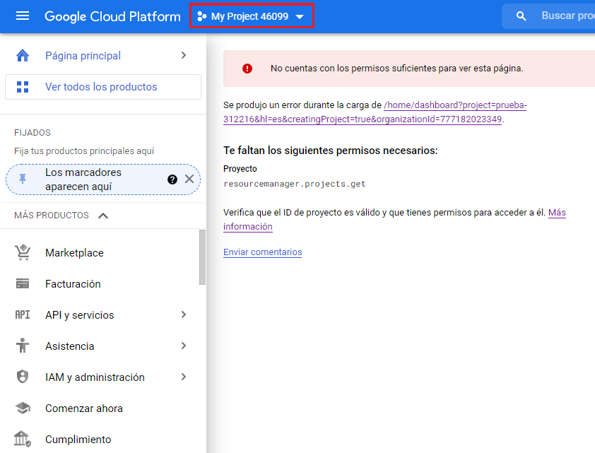
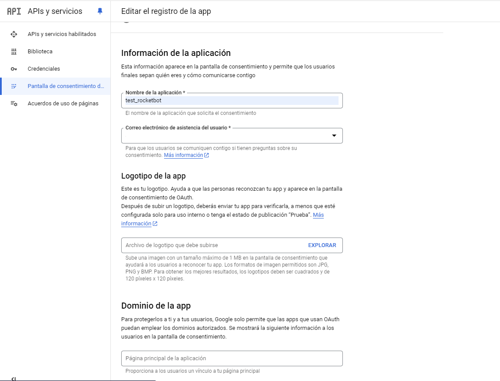
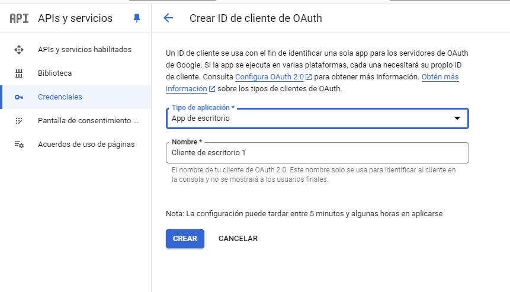

# Google Drive
  
Module to connect to Google Drive and manage your files. You can work with owned or shared files and folders, move, delete, download, export and upload them.  

*Read this in other languages: [English](Manual_gdrive.md), [Português](Manual_gdrive.pr.md), [Español](Manual_gdrive.es.md)*
  

## How to install this module
  
To install the module in Rocketbot Studio, it can be done in two ways:
1. Manual: __Download__ the .zip file and unzip it in the modules folder. The folder name must be the same as the module and inside it must have the following files and folders: \__init__.py, package.json, docs, example and libs. If you have the application open, refresh your browser to be able to use the new module.
2. Automatic: When entering Rocketbot Studio on the right margin you will find the **Addons** section, select **Install Mods**, search for the desired module and press install.  

## How to use this module

Before using this module, you need to register your application in the Google Cloud portal. To do this, you must follow these steps:

1. Go to [Google Console](https://console.cloud.google.com/projectcreate?previousPage=%2Fhome%2Fdashboard) to create a new project (If you already have one created, skip this step) and fill in the data indicated in the form

In the top bar you will see the name of the project. If it is not displayed, switch to the created project by clicking on the in the menu that is highlighted in the image.

2. Go to **API and Services** on the left panel, and after changing to the page, click on **ENABLE APIs AND SERVICES**

3. Within the "Search API and services" search engine, type **Google Drive API**. Then, enable the API by clicking on **Enable**

You will be redirected to the API configuration page.

4. In 
the side panel, click on **OAuth consent screen**. If you have a corporate Gmail account, you will be able to use the API indefinitely and you will see that the user type is **Internal**. If you have a free Gmail account, you will have to give consent once a week to be able to connect to your email account. Your user type is **External** and you will have to add test users. Then press the **Create** button

5. Select the name of the app and the required fields as appropriate. Then click next.

6. Skip the **Permissions** screen, click the Save and Continue button at the bottom of the page.

7. On the **Test Users** screen, click the **Add User** button and add your user. Click Save and Continue

8. Go from the Left Navigation Menu to **Credentials**. Press **+Create Credentials** and indicate the option **OAuth Client ID**

9. Select as 
Application Type: **Desktop App**. Enter a name for the application and press the **Create** button

10. It will create the credentials for us, click on **Download JSON** and then on **Accept**. It is important to keep the downloaded file. It will be used later in the module.

Note: When the first connection is made, a .pickle file will be created in the Rocketbot root folder, to connect to the same service from another account you must delete
that file. Do the same procedure for the case in which the credentials expire.

## Description of the commands

### Setup G-Suite credentials
  
Configure Google Drive credentials
|Parameters|Description|example|
| --- | --- | --- |
|Credentials file path|JSON file with the credentials to access the Google Drive API.|C:\Usuario\Desktop\credentials.json|
|Port (Optional)||8080|
|Session||session|

### List files in Drive
  
List files of Google Drive. This command returns all files by default, including trashed files. If you don't want trashed files to appear in the list, use the trashed=false as filter.
|Parameters|Description|example|
| --- | --- | --- |
|Filter||mimeType = 'application/vnd.google-apps.folder' and trashed = false|
|Owned files only||-|
|Shared with me files only||-|
|More data||-|
|Assign result to var||var|
|Session||session|

### Download file
  
Download file from Drive
|Parameters|Description|example|
| --- | --- | --- |
|File ID (Drive)||1iySKcDSSHoRxjlNBS4WIANMi9RLp-t8mwYmc-61cvTo|
|Path where to save file||C:\users\usuario\Downloads|
|Session||session|

### Download folder
  
Download folder from Drive
|Parameters|Description|example|
| --- | --- | --- |
|Folder ID (Drive)||1iySKcDSSHoRxjlNBS4WIANMi9RLp-t8mwYmc-61cvTo|
|Path where to save folder||C:\users\usuario\Downloads|
|Session||session|

### Export file
  
Export a file from Drive to the requested format type
|Parameters|Description|example|
| --- | --- | --- |
|File ID (Drive)||1iySKcDSSHoRxjlNBS4WIANMi9RLp-t8mwYmc-61cvTo|
|File format (Drive)||---- Select format ----|
|Path where to save file||C:\users\usuario\Downloads|
|Session||session|

### Create Folder
  
Create Folder
|Parameters|Description|example|
| --- | --- | --- |
|File ID (Drive)||1iySKcDSSHoRxjlNBS4WIANMi9RLp-t8mwYmc-61cvTo|
|Folder name||New Folder|
|Assign result to var||var|
|Session||session|

### Copy or move file
  
Copy or move a file
|Parameters|Description|example|
| --- | --- | --- |
|File ID (Drive)||1iySKcDSSHoRxjlNBS4WIANMi9RLp-t8mwYmc-61cvTo|
|Destiny Folder ID||1iySKcDSSHoRxjlNBS4WIANMi9RLp-t8mwYmc-61cvTo|
|Move or Copy||var|
|Assign result to var||var|
|Session||session|

### Upload file
  
Upload a file to Google Drive
|Parameters|Description|example|
| --- | --- | --- |
|File path||C:\file.txt|
|New name (optional)||new_name.txt|
|Save to folder - ID (optional)||1iySKcDSSHoRxjlNBS4WIANMi9RLp-t8mwYmc-61cvTo|
|Convert to Google format|If checked, it will try to upload the file as Google's equivalent format (if any), if not, it will upload the original file.||
|Assign result to var||var|
|Session||session|

### Upload folder
  
Upload a folder to Google Drive
|Parameters|Description|example|
| --- | --- | --- |
|Folder path||C:\folder|
|Save to folder - ID (optional)||1iySKcDSSHoRxjlNBS4WIANMi9RLp-t8mwYmc-61cvTo|
|New name (optional)|New name for the root folder to upload. It's optional.|new_name|
|Convert to Google format|If checked, it will try to upload the file as Google's equivalent format (if any), if not, it will upload the original file.||
|Assign result to var||var|
|Session||session|

### Delete a file or folder
  
Delete a file or folder from Drive
|Parameters|Description|example|
| --- | --- | --- |
|File ID (Drive)||1iySKcDSSHoRxjlNBS4WIANMi9RLp-t8mwYmc-61cvTo|
|Assign result to var||var|
|Session||session|

### Share file
  
Share a file in Drive
|Parameters|Description|example|
| --- | --- | --- |
|File ID (Drive)||1iySKcDSSHoRxjlNBS4WIANMi9RLp-t8mwYmc-61cvTo|
|Type||---- Select ----|
|Role||---- Select ----|
|Email or Domain|||
|Send notification email||-|
|Transfer ownership||-|
|Move file to new owner's root folder||-|
|Assign result to var||var|
|Session||session|

### List permissions
  
Get list of permissions from a file
|Parameters|Description|example|
| --- | --- | --- |
|File ID (Drive)||1iySKcDSSHoRxjlNBS4WIANMi9RLp-t8mwYmc-61cvTo|
|Assign result to var||var|
|Session||session|

### Delete permission
  
Delete a permission from a file
|Parameters|Description|example|
| --- | --- | --- |
|File ID (Drive)||1iySKcDSSHoRxjlNBS4WIANMi9RLp-t8mwYmc-61cvTo|
|Permission ID (Drive)||15224413836718185781|
|Assign result to var||var|
|Session||session|
